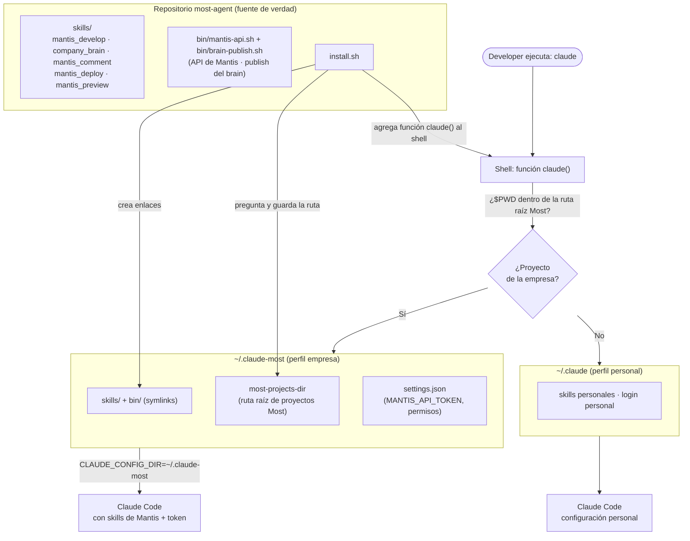
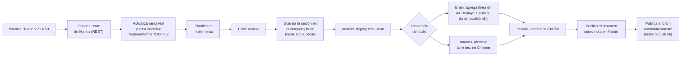

# most-agent

Skills compartidas de Claude Code para los proyectos de Grupo Most (GEINS y relacionados).

Las skills viven en este repositorio (única fuente de verdad, versionada en git) y se instalan en un directorio de configuración de Claude Code mediante enlaces simbólicos, de modo que un `git pull` aquí las actualiza en todos lados.

## Cómo funciona



El ciclo de trabajo diario con un issue:



Dos publicaciones automáticas del brain conviven en este flujo (`bin/brain-publish.sh`, ver más abajo): la del deploy (paso I) y la del comentario (paso M). La sesión guardada en el paso F, en cambio, queda **local** hasta que una de esas dos ocurra, o alguien corra `/company_brain publicar 200759` a mano.

## Instalación

Las skills se instalan por defecto en `~/.claude-most`, un directorio de configuración de Claude Code dedicado a la cuenta de Most, separado de tu `~/.claude` personal.

El instalador además configura un **selector de perfil** en el shell para que nunca tengas que elegir el perfil a mano:

- Ejecutar `claude` dentro de `~/projects/most/*` usa automáticamente `~/.claude-most` (cuenta de la empresa, skills de Mantis, token).
- Ejecutar `claude` en cualquier otro lugar usa tu `~/.claude` personal, como siempre.
- `claude-most` fuerza el perfil de la empresa desde cualquier ubicación.

¿Cómo decide? La función `claude()` instalada en el shell compara el directorio actual (`$PWD`) contra el **directorio raíz de proyectos de Most**:

- Durante la instalación, el script **pregunta cuál es esa ruta**, proponiendo como default la carpeta padre de este repositorio (porque `most-agent` normalmente se clona junto a los demás repos de la empresa). Cada desarrollador confirma con Enter o escribe la suya.
- La ruta elegida se guarda en `~/.claude-most/most-projects-dir`. La función del shell la lee en cada ejecución, así que **para cambiarla después basta con editar ese archivo** — no hace falta reinstalar.

En Windows con Git Bash las rutas se manejan en formato POSIX (`/c/Users/...`), igual que en Linux/macOS, así que la comparación funciona sin cambios.

El selector se escribe en `~/.bashrc` en Linux/Git Bash (y en `~/.zshrc` si existe), y en `~/.zshrc` en macOS. Para PowerShell el script imprime la función a agregar en tu `$PROFILE`.

La primera vez que Claude se ejecuta con el perfil de la empresa pide iniciar sesión: usá tu cuenta corporativa. Login, settings, memoria y skills quedan totalmente aislados de tu configuración personal.

### 1. Instalar las skills

#### Linux / macOS

```bash
git clone <url-de-este-repo> && cd most-agent
./install.sh
```

Las skills quedan **enlazadas** (symlinks) en `~/.claude-most/skills/`. Para actualizar después:

```bash
git pull   # los enlaces toman los cambios automáticamente, no hace falta reinstalar
```

#### Windows

Usar Git Bash (incluido con Git para Windows):

```bash
./install.sh
```

En Windows el script **copia** las skills en lugar de enlazarlas (los symlinks requieren permisos de administrador o el Modo Desarrollador). Después de actualizar el repositorio, volvé a ejecutar:

```bash
git pull && ./install.sh
```

#### Directorio de destino personalizado

El directorio de configuración de destino se resuelve en este orden:

```bash
./install.sh /ruta/al/config              # 1. argumento explícito
CLAUDE_CONFIG_DIR=... ./install.sh        # 2. variable de entorno
./install.sh                              # 3. por defecto: ~/.claude-most
```

Ejemplo — instalar también en tu cuenta personal: `./install.sh ~/.claude`

### 2. Configurar el token de Mantis (por desarrollador, una sola vez)

Las skills de Mantis necesitan `MANTIS_API_TOKEN` (Mantis: My Account → API Tokens). Agregalo una vez en el directorio de configuración de la empresa, `~/.claude-most/settings.json`, y aplica a todos los proyectos que abras con el perfil de la empresa:

```json
{
  "env": {
    "MANTIS_API_TOKEN": "<tu-token>"
  }
}
```

Alternativa: un token específico de proyecto puede definirse en el `.claude/settings.local.json` de ese proyecto (nunca se commitea) con la misma estructura — tiene precedencia para ese proyecto.

### 3. Configurar las credenciales de Jenkins (solo si vas a usar `mantis_deploy`)

En el mismo `~/.claude-most/settings.json`, junto al token de Mantis:

```json
{
  "env": {
    "MANTIS_API_TOKEN": "<tu-token>",
    "JENKINS_USER": "<tu-usuario>",
    "JENKINS_API_TOKEN": "<tu-token-de-jenkins>"
  }
}
```

El token de Jenkins se genera en `https://jenkins.grupomost.com/user/<tu-usuario>/security/`. Es **personal**: cada uno deploya con su identidad, así el log de Jenkins registra quién disparó cada build — que es justamente lo que se pierde con un token compartido.

## El helper `bin/mantis-api.sh`

Todas las llamadas a la API de Mantis pasan por un único script versionado en este repo, `bin/mantis-api.sh`. Las skills nunca arman `curl` a mano.

```bash
~/.claude-most/bin/mantis-api.sh issue  201352            # trae el issue (JSON)
~/.claude-most/bin/mantis-api.sh notes  201352 nota.json  # publica una nota
~/.claude-most/bin/mantis-api.sh status 201352 80         # cambia el estado (80 = resuelta)
~/.claude-most/bin/mantis-api.sh whoami                   # verifica que el token funcione
```

Por qué existe: el permiso de Bash en Claude Code se evalúa por **prefijo del texto del comando**. Un `curl` con headers y variables cambia de forma en cada llamada y no hay regla que lo cubra, así que Claude pedía autorización cada vez. Con un comando estable alcanza una sola regla, que `install.sh` agrega automáticamente a `settings.json`:

```json
{ "permissions": { "allow": ["Bash(~/.claude-most/bin/mantis-api.sh:*)"] } }
```

El script resuelve el token solo (variable de entorno → `.claude/settings.local.json` del proyecto → `$CLAUDE_CONFIG_DIR/settings.json` → `~/.claude-most/settings.json`) y nunca lo imprime. Códigos de salida: `0` ok, `2` uso incorrecto, `3` token no encontrado, `4` error HTTP (401/403 token inválido, 404 issue inexistente).

### En otra computadora o en otro repo

No hay que recrear nada a mano: el script vive en este repositorio, no en tu configuración local. Lo único local es el enlace simbólico.

```bash
git clone https://github.com/manuonda/most-agent && cd most-agent
./install.sh        # enlaza skills/ + bin/ y agrega la regla de permiso
```

Después basta con configurar tu `MANTIS_API_TOKEN` (paso 2) — es lo único personal de cada máquina. Actualizaciones posteriores: `git pull` (en Windows, `git pull && ./install.sh`, porque allí se copia en vez de enlazar).

El helper se instala siempre en `~/.claude-most/bin/`, aunque elijas otro directorio de configuración, porque las skills lo invocan con esa ruta exacta y la regla de permiso debe coincidir literalmente. Si instalás en otro `CLAUDE_CONFIG_DIR`, se enlaza en ambos lugares.

Funciona en cualquier repo de la empresa: la skill no depende del proyecto, solo de que el helper esté enlazado en el home del desarrollador.

## El company brain

Base de conocimiento compartida del equipo sobre el trabajo de Mantis: una nota markdown por issue en `brain/mantis/<proyecto-slug>/<issue>.md`, versionada en este mismo repo y symlinkeada como `~/.claude-most/brain` por `install.sh` — se ve en la misma ruta sin importar qué proyecto tengas abierto.

Cada nota tiene cuatro secciones (se crean vacías si todavía no hay contenido):

- `## Qué se hizo` — la escribe `mantis_develop` al cerrar una sesión de trabajo.
- `## Notas de testing / pendientes`
- `## Resumen enviado a Mantis` — el texto que `mantis_comment` posteó.
- `## Deploys` — una línea por deploy (entorno, build, resultado, rama, fecha), la agrega `mantis_deploy`.

**Publicar (commit + push) no siempre es manual.** Hay dos caminos:

- **Manual, explícito**: `/company_brain publicar <issue>` — muestra el diff y pide confirmación antes de commitear. Es el único camino para lo que guarda `mantis_develop` (una sesión en progreso, sin revisar todavía).
- **Automático, sin preguntar**: `mantis_comment` (justo después de postear la nota a Mantis) y `mantis_deploy` (justo después de que termina un deploy en una rama `feature/mantis_0<issue>`) publican solos, vía `bin/brain-publish.sh`. En ambos casos el contenido ya está aprobado o es un hecho objetivo — no hay nada que revisar antes de que el equipo lo vea.

Hasta que se publica por cualquiera de esos dos caminos, la nota **solo existe en el clon local** de quien la escribió — otro developer que corra `/company_brain <issue>` en su máquina no la va a ver todavía (aunque la ruta `~/.claude-most/brain/...` sea idéntica en ambas). Las lecturas (`/company_brain <issue>`, y el paso 1 de `mantis_comment`) hacen `git pull` antes de responder, así que siempre reflejan lo último publicado por cualquiera del equipo.

## El helper `bin/brain-publish.sh`

Es el **único** camino permitido para hacer `commit`/`push` contra `~/.claude-most/brain` sin que Claude Code pregunte permiso cada vez — mismo motivo que `bin/mantis-api.sh` reemplazando `curl` suelto: un comando estable se puede allow-listear una sola vez.

```bash
~/.claude-most/bin/brain-publish.sh 200759
```

Qué hace: `git pull --rebase` → si la nota de ese issue tiene cambios pendientes, `add` + `commit` + `push` solo de ese archivo. Si no hay nota local o no hay cambios, no hace nada (exit 0). Nunca fuerza un push — si el rebase o el push fallan, corta y devuelve el error tal cual, para reintentar después con `/company_brain publicar <issue>`.

```json
{ "permissions": { "allow": ["Bash(~/.claude-most/bin/brain-publish.sh:*)"] } }
```

Lo usan `mantis_comment` y `mantis_deploy` (ver arriba). La publicación manual de `company_brain` (`/company_brain publicar <issue>`) sigue usando `git` directo a propósito: ese flujo muestra el diff y pide confirmación antes de commitear, algo distinto de "publicar sin preguntar".

## La skill `mantis_preview`

Complementa a `mantis_deploy`: abre el entorno de **test** del proyecto actual en Chrome (usando la skill `claude-in-chrome`) para ver visualmente los cambios, sin salir del chat. Por ahora cubre solo `test` — `demo` y `release` quedan afuera.

```bash
~/.claude-most/skills/mantis_preview/scripts/preview-url.sh
```

No tiene configuración propia: reutiliza `jenkins-api.sh` y `config/projects.json` de `mantis_deploy` para identificar el proyecto y su job `TEST-*`, y lee la URL desde el campo **description** de ese job en Jenkins (ej. `https://test-geins-ypf.grupomost.com/most-geins`) vía la API — nunca hardcodeada acá, así que no se desincroniza si cambia en Jenkins. Si el job no tiene una URL publicada en su description, el script lo dice explícitamente en vez de inventar una.

## Desinstalación

```bash
./uninstall.sh                    # elimina de ~/.claude-most/skills
./uninstall.sh /ruta/al/config    # o de un directorio de configuración personalizado
```

## Skills disponibles

| Skill | Disparador | Qué hace |
|-------|------------|----------|
| `mantis_develop` | `/mantis_develop <issue>` | Obtiene el issue de Mantis, actualiza `test`, crea un worktree con la rama `feature/mantis_0<issue>`, planifica, implementa y revisa. Al cerrar la sesión, guarda un resumen en el company brain (local). |
| `company_brain` | `/company_brain <issue>`, "estado del mantis X", "/company_brain publicar <issue>" | Lee y escribe la nota compartida del equipo sobre un issue (qué se hizo, testing, deploys, resumen enviado a Mantis) y, a pedido, la publica (commit+push). |
| `mantis_deploy` | `/mantis_deploy <entorno>`, "deployar a test" | Dispara y monitorea deploys en Jenkins (`test`, `demo`, `release`) para el repo donde estás parado. Si la rama es `feature/mantis_0<issue>`, deja el resultado en el brain del issue y lo publica solo. |
| `mantis_preview` | `/mantis_preview`, "mostrame los cambios en test" | Abre el entorno de **test** del proyecto actual en Chrome (vía `claude-in-chrome`), resolviendo la URL desde la *description* del job de Jenkins — nunca hardcodeada. |
| `mantis_comment` | `/mantis_comment <issue> [archivos...]` | Resume el trabajo realizado sobre un issue y lo publica como nota en Mantis, con adjuntos opcionales. Después, publica el brain automáticamente. |

## La skill `mantis_deploy`

Detecta el proyecto desde el **remote git** del directorio actual (no desde la ruta local: cada dev clona donde quiere) y lo busca en `skills/mantis_deploy/config/projects.json`, que está versionado acá y es igual para todo el equipo. Cada proyecto declara solo los entornos que realmente tiene en su Jenkins.

```bash
~/.claude-most/skills/mantis_deploy/scripts/status.sh              # qué entornos hay y cómo quedó el último build
~/.claude-most/skills/mantis_deploy/scripts/deploy.sh test         # encola y devuelve la URL de consola
~/.claude-most/skills/mantis_deploy/scripts/deploy.sh test --wait  # espera el resultado final
~/.claude-most/skills/mantis_deploy/scripts/discover.sh --suggest GEINS-YPF   # alta de un proyecto nuevo
```

`--wait` es el modo por default cuando se dispara desde el chat: el script sondea Jenkins hasta que el build termina e imprime `Resultado: SUCCESS|FAILURE|...`, saliendo con código distinto de 0 si no fue `SUCCESS` — ese resultado se reporta tal cual, no solo la URL de cola.

Tres decisiones deliberadas:

- **No se habilita `Bash(curl:*)`.** La allow-list cubre solo esos tres scripts. Si Claude pudiera hacer `curl` arbitrario con `$JENKINS_API_TOKEN` en el entorno, llegaría a cualquier endpoint de Jenkins, incluida la consola de scripts. La superficie queda acotada a lo que está escrito acá.
- **Producción no se deploya desde acá.** Los jobs `PROD-*` se declaran en el bloque `blocked` de cada proyecto: quedan documentados, pero el script los rechaza aunque alguien pase el nombre a mano. Un "no" explícito es mejor que un job que no aparece en el mapa.
- **El resultado queda en el company brain.** Si la rama actual es `feature/mantis_0<issue>` (la convención de `mantis_develop`), el resultado se agrega a `## Deploys` en la nota de ese issue y se publica solo con `bin/brain-publish.sh` (ver "El company brain"). Fuera de esa convención de rama, no se escribe nada — no hay issue al que asociarlo.

### Dar de alta un proyecto nuevo (gecap, gecon, poncho...)

`config/projects.json` es lo único que se toca. Para averiguar los nombres reales de los jobs:

```bash
cd <el-repo>
~/.claude-most/skills/mantis_deploy/scripts/discover.sh                    # lista carpetas y jobs
~/.claude-most/skills/mantis_deploy/scripts/discover.sh --suggest <CARPETA>   # imprime el bloque JSON
```

Revisá el bloque sugerido, pegalo en `config/projects.json`, poné `verified: true` y commiteá: el resto del equipo lo hereda con `git pull`.

## Agregar una nueva skill

1. Crear `skills/<nombre-skill>/SKILL.md` con frontmatter (`name`, `description` incluyendo los disparadores explícitos).
2. Volver a ejecutar `./install.sh` (solo necesario en Windows o para skills recién agregadas — un directorio nuevo necesita un enlace nuevo).
3. Commitear y pushear para que el equipo las reciba con `git pull`.
